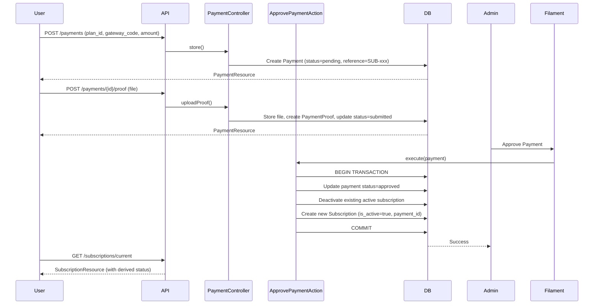

# Design Document: Plan Subscription

## Overview

The plan-subscription feature enables authenticated users to subscribe to plans through a manual payment verification flow. A user initiates a payment, uploads proof of payment, and an admin approves or rejects it via the Filament admin panel. Upon approval, an active subscription is created and the user gains access to subscription-gated resources.

The design follows the existing patterns in the codebase: Action classes for business logic, FormRequest classes for validation, API Resources for response shaping, and Filament resources for admin management. The payment flow mirrors the existing pool investment pattern.

### Key Design Decisions

- **Reference generation is backend-only**: The `reference` field is generated server-side using a unique string (e.g., `SUB-{ULID}`), not accepted from the client, to prevent tampering.
- **Atomic approval**: Subscription creation on payment approval is wrapped in a database transaction to ensure consistency.
- **Derived subscription status**: `SubscriptionStatus` (`active`, `expired`, `inactive`) is computed at read time from `is_active` and `ends_at`, not stored.
- **Scheduled expiry**: A Laravel scheduled command marks expired subscriptions inactive daily.
- **`subscribed` middleware**: A named middleware enforces active subscription checks on protected routes.
- **No new migrations needed**: The `subscriptions`, `payments`, `payment_proofs`, and `payment_gateways` tables already exist. The `Subscription` model needs a `payment_id` foreign key added.

---

## Architecture



### Component Overview

```
app/
├── Actions/
│   └── ApprovePaymentAction.php          # Atomic approval + subscription creation
├── Console/Commands/
│   └── ExpireSubscriptionsCommand.php    # Scheduled expiry job
├── DTOs/
│   └── InitiatePaymentData.php           # Payment initiation DTO
├── Enums/
│   └── SubscriptionStatus.php            # active | expired | inactive
├── Http/
│   ├── Controllers/Api/V1/
│   │   ├── PaymentController.php         # (extend existing) + index, store, show, uploadProof
│   │   └── SubscriptionController.php    # current, history
│   ├── Middleware/
│   │   └── EnsureActiveSubscription.php  # 'subscribed' middleware
│   ├── Requests/Api/V1/
│   │   └── StorePaymentRequest.php       # (update) enforce plan active + amount match
│   └── Resources/V1/
│       └── SubscriptionResource.php      # with derived status
├── Models/
│   └── Subscription.php                  # (update) add payment_id, status accessor
└── Filament/Admin/Resources/
    └── Payments/                         # New Filament resource for payment management
        ├── PaymentResource.php
        ├── Pages/
        │   ├── ListPayments.php
        │   └── EditPayment.php
        ├── Schemas/PaymentForm.php
        └── Tables/PaymentsTable.php

database/migrations/
└── xxxx_add_payment_id_to_subscriptions_table.php
```

---

## Components and Interfaces

### API Endpoints

| Method | URI | Auth | Middleware | Description |
|--------|-----|------|------------|-------------|
| `GET` | `/api/v1/payments` | ✓ | `auth:sanctum` | List user's payments (Req 8) |
| `POST` | `/api/v1/payments` | ✓ | `auth:sanctum` | Initiate payment (Req 1) |
| `GET` | `/api/v1/payments/{payment}` | ✓ | `auth:sanctum` | Show single payment |
| `POST` | `/api/v1/payments/{payment}/proof` | ✓ | `auth:sanctum` | Upload proof (Req 2) |
| `GET` | `/api/v1/subscriptions/current` | ✓ | `auth:sanctum` | Active subscription (Req 4) |
| `GET` | `/api/v1/subscriptions` | ✓ | `auth:sanctum` | Subscription history (Req 5) |

### `StorePaymentRequest` (updated)

The existing request class needs two additional validation rules:

```php
// Validate plan is active
'plan_id' => ['required', 'integer', Rule::exists('plans', 'id')->where('is_active', true)],
// Validate amount matches plan price
'amount'  => ['required', 'numeric', new MatchesPlanPrice($request->plan_id)],
// reference is NOT accepted from client — generated server-side
```

A custom `MatchesPlanPrice` rule resolves the plan and compares `$value == $plan->price`.

### `PaymentController` (updated)

The `store()` method generates the reference server-side:

```php
'reference' => 'SUB-' . strtoupper((string) \Illuminate\Support\Str::ulid()),
```

The `uploadProof()` method enforces that the payment belongs to the authenticated user (via `Gate::authorize('view', $payment)`) and that the payment status is `pending` before accepting the file.

### `SubscriptionController`

```php
// GET /subscriptions/current
public function current(Request $request): JsonResponse
// GET /subscriptions
public function index(Request $request): JsonResponse
```

`current()` returns the user's active subscription or a 404 with a descriptive message. `index()` returns a paginated list ordered by `starts_at` descending.

### `ApprovePaymentAction`

Encapsulates the atomic approval logic:

```php
public function execute(Payment $payment): Subscription
{
    return DB::transaction(function () use ($payment) {
        $payment->update(['status' => PaymentStatus::Approved]);

        // Deactivate any existing active subscription
        $payment->user->subscriptions()
            ->where('is_active', true)
            ->update(['is_active' => false]);

        // Create new subscription
        return $payment->user->subscriptions()->create([
            'plan_id'    => $payment->plan_id,
            'payment_id' => $payment->id,
            'starts_at'  => now(),
            'ends_at'    => now()->addDays($payment->plan->duration_days),
            'is_active'  => true,
        ]);
    });
}
```

### `EnsureActiveSubscription` Middleware

Registered as `subscribed` in `bootstrap/app.php`:

```php
public function handle(Request $request, Closure $next): Response
{
    $user = $request->user();

    if (! $user || ! $user->activeSubscription) {
        return response()->json([
            'status'  => 'error',
            'message' => 'An active subscription is required to access this resource.',
        ], 403);
    }

    return $next($request);
}
```

### `ExpireSubscriptionsCommand`

```php
// Signature: subscriptions:expire
// Scheduled: daily in routes/console.php

Subscription::where('is_active', true)
    ->where('ends_at', '<', now())
    ->update(['is_active' => false]);
```

### Filament `PaymentResource`

A new Filament resource under the "Subscriptions" navigation group. The edit form exposes a status select field with an action button to approve or reject. Approval triggers `ApprovePaymentAction`. Rejection sets status to `rejected` without creating a subscription.

---

## Data Models

### `subscriptions` table (migration needed)

Add `payment_id` foreign key:

```php
$table->foreignId('payment_id')->nullable()->constrained()->nullOnDelete();
```

### `Subscription` model (updated)

```php
protected $fillable = [
    'user_id', 'plan_id', 'payment_id',
    'starts_at', 'ends_at', 'is_active',
];

// Derived status accessor
public function getStatusAttribute(): SubscriptionStatus
{
    if ($this->ends_at->isPast()) {
        return SubscriptionStatus::Expired;
    }
    if ($this->is_active) {
        return SubscriptionStatus::Active;
    }
    return SubscriptionStatus::Inactive;
}

public function payment(): BelongsTo
{
    return $this->belongsTo(Payment::class);
}
```

### `SubscriptionStatus` enum

```php
enum SubscriptionStatus: string
{
    case Active   = 'active';
    case Expired  = 'expired';
    case Inactive = 'inactive';
}
```

### `SubscriptionResource`

```php
return [
    'id'         => $this->id,
    'plan'       => new PlanResource($this->whenLoaded('plan')),
    'starts_at'  => $this->starts_at->toDateTimeString(),
    'ends_at'    => $this->ends_at->toDateTimeString(),
    'status'     => $this->status->value,  // derived
    'created_at' => $this->created_at->toDateTimeString(),
];
```

### `InitiatePaymentData` DTO

```php
readonly class InitiatePaymentData
{
    public function __construct(
        public int    $plan_id,
        public string $gateway_code,
        public float  $amount,
    ) {}

    public static function fromRequest(StorePaymentRequest $request): self
    {
        return new self(
            plan_id:      $request->integer('plan_id'),
            gateway_code: $request->string('gateway_code')->value(),
            amount:       $request->float('amount'),
        );
    }
}
```

### Relationships Summary

```
User
 ├── hasMany → Payment
 ├── hasMany → Subscription
 └── hasOne  → activeSubscription (where is_active=true, latestOfMany)

Payment
 ├── belongsTo → User
 ├── belongsTo → Plan
 ├── belongsTo → PaymentGateway
 ├── hasMany   → PaymentProof
 └── hasOne    → Subscription

Subscription
 ├── belongsTo → User
 ├── belongsTo → Plan
 └── belongsTo → Payment
```

---

## Error Handling

| Scenario | HTTP Status | Message |
|----------|-------------|---------|
| Plan not found or inactive | 422 | Validation error on `plan_id` |
| Gateway not found or inactive | 422 | Validation error on `gateway_code` |
| Amount does not match plan price | 422 | Validation error on `amount` |
| Upload proof for non-owned payment | 403 | Forbidden |
| Upload proof for non-pending payment | 422 | "Payment is not in a pending state" |
| Invalid file type (not jpeg/png/webp/pdf) | 422 | Validation error on `proof` |
| File exceeds 5 MB | 422 | Validation error on `proof` |
| No active subscription on gated endpoint | 403 | "An active subscription is required to access this resource." |
| No active subscription on `GET /subscriptions/current` | 404 | "You do not have an active subscription." |
| Approval transaction failure | 500 | Generic server error (transaction rolled back) |

The `uploadProof()` method must check `$payment->status === PaymentStatus::Pending` before accepting the file, returning a 422 if not.

---

## Testing Strategy

PBT is not appropriate for this feature. The feature is primarily CRUD operations with side effects (file storage, admin workflows, scheduled jobs). The behavior does not vary meaningfully across a wide input space in ways that 100 iterations would reveal more bugs than 2-3 targeted examples. Instead, the testing strategy uses unit tests and feature/integration tests.

### Unit Tests

- `ApprovePaymentAction`: verify transaction atomicity, subscription creation fields, deactivation of prior active subscription, and that rejection does not create a subscription.
- `EnsureActiveSubscription` middleware: verify 403 for users without active subscription, 200 pass-through for users with active subscription.
- `SubscriptionStatus` derived accessor: verify `active`, `expired`, and `inactive` states from model field combinations.
- `ExpireSubscriptionsCommand`: verify only subscriptions with `ends_at < now()` and `is_active = true` are updated.
- `MatchesPlanPrice` rule: verify it passes when amount equals plan price and fails otherwise.

### Feature / Integration Tests

- `POST /payments`: valid payload creates payment with `pending` status and backend-generated reference; invalid plan_id, inactive plan, wrong amount, inactive gateway each return 422.
- `POST /payments/{id}/proof`: valid upload transitions status to `submitted`; non-owned payment returns 403; invalid file type and oversized file return 422; non-pending payment returns 422.
- `GET /subscriptions/current`: returns active subscription with correct derived status; returns 404 when no active subscription exists.
- `GET /subscriptions`: returns paginated list ordered by `starts_at` descending with plan details and derived status.
- `GET /payments`: returns paginated list with plan, gateway, and proof details.
- Subscription-gated endpoint: returns 403 without active subscription, 200 with active subscription.
- Scheduled command: integration test verifying expired subscriptions are marked inactive after command runs.
