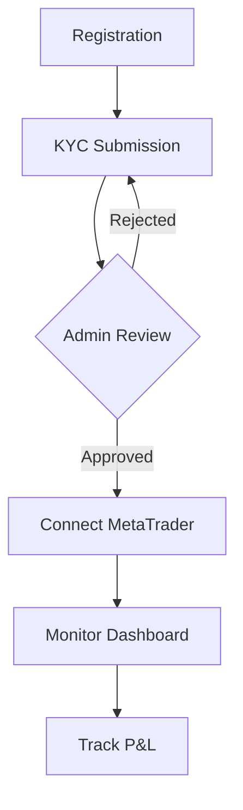
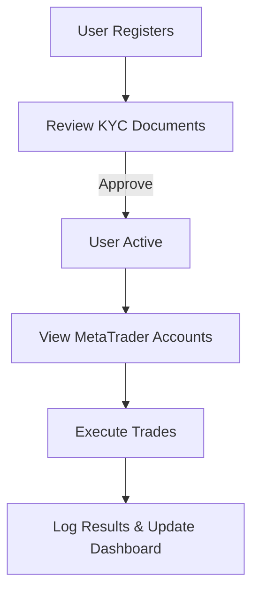

# Product Requirements Document (PRD)

## JMJ Trading Platform API

> **Version:** 1.1  
> **Status:** Draft  
> **Last Updated:** March 7, 2026

---

## 1. Executive Summary

The **JMJ Trading Platform** is an app based trading management system designed to bridge the gap between investors and professional traders (Admins). It allows investors to securely connect their **MetaTrader 4/5** accounts to a centralized platform where authorized administrators can execute trades on their behalf.

Investors retain full visibility of their account performance, profit/loss (P&L), and trade history through a personalized dashboard, while the actual trade execution is managed by professionals.

---

## 2. Table of Contents

- [1. Executive Summary](#1-executive-summary)
- [3. Product Objectives](#3-product-objectives)
- [4. User Personas](#4-user-personas)
- [5. System Architecture & Workflows](#5-system-architecture--workflows)
- [6. Core Features & Requirements](#6-core-features--requirements)
- [7. Data Models](#7-data-models)
- [8. Security & Compliance](#8-security--compliance)
- [9. Technical Stack](#9-technical-stack)
- [10. External Integrations](#10-external-integrations)

---

## 3. Product Objectives

The primary goals of the platform are to:

- **Secure Connection:** Provide a safe method for investors to bridge their MetaTrader accounts.
- **KYC Compliance:** Ensure all investors are verified before any trading activity begins.
- **Professional Management:** Enable authorized admins to manage multiple investor accounts from a single interface.
- **Transparency:** Offer real-time visibility into trading performance and history for the investor.
- **Security:** Safeguard sensitive credentials using industry-standard encryption and access controls.

---

## 4. User Personas

### 4.1 Investor (User)

The individual providing the capital and the MetaTrader account.

- **Goals:** Monitor growth, ensure account security, and track performance.
- **Key Actions:** Register, submit KYC, link MetaTrader, and view dashboards.

### 4.2 Admin (Trader)

The professional responsible for executing market orders and managing portfolios.

- **Goals:** Efficiently manage trades across multiple accounts and maintain platform health.
- **Key Actions:** Review KYC, access managed account credentials, execute trades, and analyze platform-wide performance.

---

## 5. System Architecture & Workflows

### 5.1 Investor Journey

### 5.2 Admin Journey

---

## 6. Core Features & Requirements

### 6.1 User Authentication & Profile

| Feature                   | Description                                              |
| :------------------------ | :------------------------------------------------------- |
| **Secure Onboarding**     | Standard email-based registration with password hashing. |
| **Identity Verification** | KYC module for document upload (ID, Proof of Address).   |
| **Account Recovery**      | Secure password reset workflow via email.                |

### 6.2 Investor Verification System (KYC)

| Status     | Description                                               |
| :--------- | :-------------------------------------------------------- |
| `Pending`  | Initial state after document upload.                      |
| `Approved` | Account is cleared for MetaTrader connection and trading. |
| `Rejected` | Admin provides a reason; investor must re-submit.         |

### 6.3 MetaTrader Integration

Connects the platform to MT4 or MT5 servers.

- **Investor Actions:** Add/Update/Remove broker credentials.
- **Admin Actions:** View list of managed accounts and retrieve credentials for trade execution.

### 6.4 Trading Management

Admins can perform full trade lifecycle management:

- **Market Orders:** Place Buy/Sell orders.
- **Position Management:** Set Stop Loss (SL) and Take Profit (TP), modify lot sizes.
- **Closure:** Close active trades and realize P&L.

---

## 7. Data Models

### 7.1 User (Identity)

| Field        | Type   | Description                 |
| :----------- | :----- | :-------------------------- |
| `id`         | UUID   | Primary Key                 |
| `name`       | String | Full name                   |
| `email`      | String | Unique email address        |
| `phone`      | String | Contact number              |
| `kyc_status` | Enum   | pending, approved, rejected |

### 7.2 MetaTrader Account

| Field            | Type      | Description              |
| :--------------- | :-------- | :----------------------- |
| `broker_name`    | String    | e.g., Exness, IC Markets |
| `account_number` | String    | The MT login ID          |
| `server`         | String    | Connection server name   |
| `password`       | Encrypted | Secured MT password      |
| `platform_type`  | Enum      | MT4, MT5                 |

### 7.3 Trade History

| Field         | Type    | Description             |
| :------------ | :------ | :---------------------- |
| `symbol`      | String  | e.g., EURUSD, XAUUSD    |
| `lot_size`    | Float   | Volume of the trade     |
| `entry_price` | Decimal | Price at execution      |
| `status`      | Enum    | Open, Closed, Cancelled |
| `profit_loss` | Decimal | Realized P&L            |

---

## 8. Security & Compliance

> [!IMPORTANT]
> **Strict Data Privacy Rules:**
>
> 1. Verification data (KYC documents) **must never** be returned to the client via API after submission.
> 2. MetaTrader credentials **must never** be accessible via the client-side API.

- **Encryption:** All MetaTrader passwords must be stored using AES-256 (or equivalent) encryption.
- **Auth:** Standard API authentication via **Laravel Sanctum** (or JWT).
- **Audit Logs:** Every Admin action (trade execution, login, credential access) must be logged.

---

## 9. Technical Stack

- **Backend:** Laravel 12 (PHP 8.5)
- **Database:** MySQL / PostgreSQL
- **Real-time:** Redis for Caching and Queue management.
- **Background Jobs:** Laravel Queues for trade synchronization and data fetching.

---

## 10. External Integrations

### MetaTrader Connectivity

The platform interacts with MT servers via one of the following:

1.  **MetaTrader Manager API:** Direct connection for broad account management.
2.  **MetaTrader Web API:** For easier integration with REST protocols.
3.  **Custom Bridge Service:** A middle-layer (often in Python/C++) to handle execution commands.

### Notifications

- **Email:** SendGrid or AWS SES for transaction alerts.
- **In-App:** Real-time updates for trade execution and closed positions.
