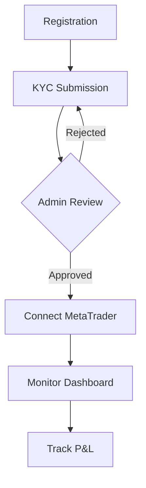
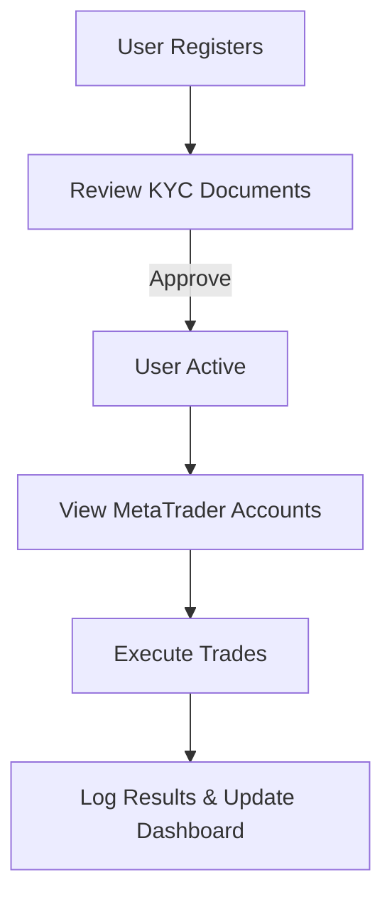
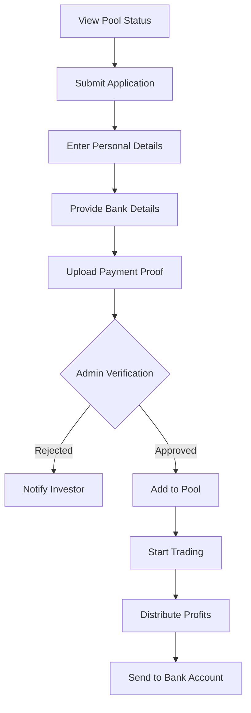

# Product Requirements Document (PRD)

## JMJ Trading Platform API

> **Version:** 1.1  
> **Status:** Draft  
> **Last Updated:** March 7, 2026

---

## 1. Executive Summary

The **JMJ Trading Platform** is an app based trading management system designed to bridge the gap between investors and professional traders (Admins). It allows investors to securely connect their **MetaTrader 4/5** accounts to a centralized platform where authorized administrators can execute trades on their behalf.

Investors retain full visibility of their account performance, profit/loss (P&L), and trade history through a personalized dashboard, while the actual trade execution is managed by professionals.

---

## 2. Table of Contents

- [1. Executive Summary](#1-executive-summary)
- [3. Product Objectives](#3-product-objectives)
- [4. User Personas](#4-user-personas)
- [5. System Architecture & Workflows](#5-system-architecture--workflows)
- [6. Core Features & Requirements](#6-core-features--requirements)
- [7. Data Models](#7-data-models)
- [8. Security & Compliance](#8-security--compliance)
- [9. Technical Stack](#9-technical-stack)
- [10. External Integrations](#10-external-integrations)
- [11. Pool Funding Feature](#11-pool-funding-feature)

---

## 3. Product Objectives

The primary goals of the platform are to:

- **Secure Connection:** Provide a safe method for investors to bridge their MetaTrader accounts.
- **KYC Compliance:** Ensure all investors are verified before any trading activity begins.
- **Professional Management:** Enable authorized admins to manage multiple investor accounts from a single interface.
- **Transparency:** Offer real-time visibility into trading performance and history for the investor.
- **Security:** Safeguard sensitive credentials using industry-standard encryption and access controls.

---

## 4. User Personas

### 4.1 Investor (User)

The individual providing the capital and the MetaTrader account.

- **Goals:** Monitor growth, ensure account security, and track performance.
- **Key Actions:** Register, submit KYC, link MetaTrader, and view dashboards.

### 4.2 Admin (Trader)

The professional responsible for executing market orders and managing portfolios.

- **Goals:** Efficiently manage trades across multiple accounts and maintain platform health.
- **Key Actions:** Review KYC, access managed account credentials, execute trades, and analyze platform-wide performance.

---

## 5. System Architecture & Workflows

### 5.1 Investor Journey

### 5.2 Admin Journey

---

## 6. Core Features & Requirements

### 6.1 User Authentication & Profile

| Feature                   | Description                                              |
| :------------------------ | :------------------------------------------------------- |
| **Secure Onboarding**     | Standard email-based registration with password hashing. |
| **Identity Verification** | KYC module for document upload (ID, Proof of Address).   |
| **Account Recovery**      | Secure password reset workflow via email.                |

### 6.2 Investor Verification System (KYC)

| Status     | Description                                               |
| :--------- | :-------------------------------------------------------- |
| `Pending`  | Initial state after document upload.                      |
| `Approved` | Account is cleared for MetaTrader connection and trading. |
| `Rejected` | Admin provides a reason; investor must re-submit.         |

### 6.3 MetaTrader Integration

Connects the platform to MT4 or MT5 servers.

- **Investor Actions:** Add/Update/Remove broker credentials.
- **Admin Actions:** View list of managed accounts and retrieve credentials for trade execution.

### 6.4 Trading Management

Admins can perform full trade lifecycle management:

- **Market Orders:** Place Buy/Sell orders.
- **Position Management:** Set Stop Loss (SL) and Take Profit (TP), modify lot sizes.
- **Closure:** Close active trades and realize P&L.

---

## 7. Data Models

### 7.1 User (Identity)

| Field        | Type   | Description                 |
| :----------- | :----- | :-------------------------- |
| `id`         | UUID   | Primary Key                 |
| `name`       | String | Full name                   |
| `email`      | String | Unique email address        |
| `phone`      | String | Contact number              |
| `kyc_status` | Enum   | pending, approved, rejected |

### 7.2 MetaTrader Account

| Field            | Type      | Description              |
| :--------------- | :-------- | :----------------------- |
| `broker_name`    | String    | e.g., Exness, IC Markets |
| `account_number` | String    | The MT login ID          |
| `server`         | String    | Connection server name   |
| `password`       | Encrypted | Secured MT password      |
| `platform_type`  | Enum      | MT4, MT5                 |

### 7.3 Trade History

| Field         | Type    | Description             |
| :------------ | :------ | :---------------------- |
| `symbol`      | String  | e.g., EURUSD, XAUUSD    |
| `lot_size`    | Float   | Volume of the trade     |
| `entry_price` | Decimal | Price at execution      |
| `status`      | Enum    | Open, Closed, Cancelled |
| `profit_loss` | Decimal | Realized P&L            |

---

## 8. Security & Compliance

> [!IMPORTANT]
> **Strict Data Privacy Rules:**
>
> 1. Verification data (KYC documents) **must never** be returned to the client via API after submission.
> 2. MetaTrader credentials **must never** be accessible via the client-side API.

- **Encryption:** All MetaTrader passwords must be stored using AES-256 (or equivalent) encryption.
- **Auth:** Standard API authentication via **Laravel Sanctum** (or JWT).
- **Audit Logs:** Every Admin action (trade execution, login, credential access) must be logged.

---

## 9. Technical Stack

- **Backend:** Laravel 12 (PHP 8.5)
- **Database:** MySQL / PostgreSQL
- **Real-time:** Redis for Caching and Queue management.
- **Background Jobs:** Laravel Queues for trade synchronization and data fetching.

---

## 10. External Integrations

### MetaTrader Connectivity

The platform interacts with MT servers via one of the following:

1.  **MetaTrader Manager API:** Direct connection for broad account management.
2.  **MetaTrader Web API:** For easier integration with REST protocols.
3.  **Custom Bridge Service:** A middle-layer (often in Python/C++) to handle execution commands.

### Notifications

- **Email:** SendGrid or AWS SES for transaction alerts.
- **In-App:** Real-time updates for trade execution and closed positions.

---

## 11. Pool Funding Feature

### 11.1 Overview

The **Pool Funding** feature enables collective investment where multiple investors can contribute to a shared trading pool. This allows investors with smaller capital to participate in professional trading while benefiting from proportional profit distribution based on their contribution.

### 11.2 Key Concepts

- **Collective Investment:** Multiple investors pool their funds together into a single trading account.
- **Minimum Investment:** $1,000 minimum contribution per investor.
- **Proportional Profits:** Returns are distributed based on each investor's percentage contribution to the total pool.
- **Transparent Performance:** Real-time visibility of pool status, total capital, investor count, and historical returns.

### 11.3 Pool Funding Workflow

### 11.4 User Interface Components

#### Pool Status Display

| Component       | Description                                                |
| :-------------- | :--------------------------------------------------------- |
| **Total Pool**  | Aggregate amount currently in the pool (e.g., $45,000)    |
| **Investors**   | Number of active participants (e.g., 23)                   |
| **Last Return** | Most recent performance percentage (e.g., +15.2%)          |
| **Min. Amount** | Minimum investment requirement ($1,000)                    |
| **Profit Info** | Clarification that profits are distributed proportionally  |

#### How It Works Section

1. **Submit Application:** Investor submits application with minimum $1,000 contribution
2. **Payment Verification:** Admin verifies payment within 24-48 hours
3. **Join Pool:** Approved funds are added to the pool and trading begins
4. **Profit Distribution:** Profits sent to investor's bank account based on their share

#### Application Form Fields

| Field                  | Type     | Required | Description                                    |
| :--------------------- | :------- | :------- | :--------------------------------------------- |
| `user_id`          | String   | Yes      | Auto-generated unique ID (e.g., INV-810823009) |
| `full_name`            | String   | Yes      | Investor's full legal name                     |
| `phone_number`         | String   | Yes      | Contact number (e.g., +234 XXX XXX XXXX)       |
| `bank_name`            | String   | Yes      | Bank for profit disbursement                   |
| `account_number`       | String   | Yes      | 10-digit bank account number                   |
| `account_name`         | String   | Yes      | Name on bank account                           |
| `contribution_amount`  | Decimal  | Yes      | Investment amount (minimum $1,000)             |
| `payment_proof_url`        | File     | Yes      | Screenshot of bank transfer or payment         |
| `terms_accepted`       | Boolean  | Yes      | Agreement to terms and profit distribution     |

### 11.5 Data Models

#### Pool Investment

| Field                | Type      | Description                                |
| :------------------- | :-------- | :----------------------------------------- |
| `id`                 | UUID      | Primary Key                                |
| `user_id`        | String    | Auto-generated investor identifier         |
| `user_id`            | UUID      | Foreign key to User table                  |
| `pool_id`            | UUID      | Foreign key to Pool table                  |
| `full_name`          | String    | Investor's full name                       |
| `phone_number`       | String    | Contact number                             |
| `bank_name`          | String    | Bank for profit disbursement               |
| `account_number`     | String    | Bank account number                        |
| `account_name`       | String    | Name on bank account                       |
| `contribution`       | Decimal   | Investment amount                          |
| `share_percentage`   | Decimal   | Calculated share of total pool             |
| `payment_proof_url | String    | Storage path for payment screenshot        |
| `status`             | Enum      | pending, verified, active, rejected        |
| `terms_accepted`     | Boolean   | Terms and conditions acceptance            |
| `created_at`         | Timestamp | Application submission date                |
| `verified_at`        | Timestamp | Admin verification date                    |

#### Pool

| Field              | Type      | Description                          |
| :----------------- | :-------- | :----------------------------------- |
| `id`               | UUID      | Primary Key                          |
| `name`             | String    | Pool identifier                      |
| `total_amount`     | Decimal   | Current total pool capital           |
| `investor_count`   | Integer   | Number of active investors           |

| `minimum_investment` | Decimal | Minimum contribution ($1,000)        |
| `status`           | Enum      | active, closed, paused               |
| `created_at`       | Timestamp | Pool creation date                   |

#### Profit Distribution

| Field              | Type      | Description                          |
| :----------------- | :-------- | :----------------------------------- |
| `id`               | UUID      | Primary Key                          |
| `pool_investment_id` | UUID    | Foreign key to Pool Investment       |
| `distribution_date` | Date     | When profit was distributed          |
| `profit_amount`    | Decimal   | Amount sent to investor              |
| `pool_return`      | Decimal   | Overall pool return percentage       |
| `status`           | Enum      | pending, processed, failed           |

### 11.6 Business Rules

1. **Minimum Investment:** All contributions must be at least $1,000
2. **Verification Period:** Payment verification takes 24-48 hours
3. **Proportional Distribution:** Profits calculated as: `(investor_contribution / total_pool) * total_profit`
4. **Share Calculation:** Updated dynamically when new investors join or existing investors add funds
5. **Payment Proof:** Required for all contributions; must be a valid screenshot or document
6. **Bank Details:** Used exclusively for profit disbursement, not for initial contribution
7. **No KYC Required:** Users do NOT need to complete KYC verification to invest in pools (unlike MetaTrader account linking which requires verification)

### 11.7 API Endpoints

| Method | Endpoint                      | Description                        |
| :----- | :---------------------------- | :--------------------------------- |
| GET    | `/api/v1/pools`               | List all active pools              |
| GET    | `/api/v1/pools/{id}`          | Get pool details and status        |
| POST   | `/api/v1/pool-investments`    | Submit pool investment application |
| GET    | `/api/v1/pool-investments`    | Get user's pool investments        |
| GET    | `/api/v1/pool-investments/{id}` | Get specific investment details  |
| PATCH  | `/api/v1/pool-investments/{id}/verify` | Admin: Verify payment      |
| GET    | `/api/v1/profit-distributions` | Get profit distribution history   |

### 11.8 Security Considerations

- **Payment Proof Storage:** Securely store uploaded payment screenshots with access restricted to admins
- **Bank Details Protection:** Encrypt bank account information at rest
- **Verification Workflow:** Only admins can approve/reject pool investment applications
- **Audit Trail:** Log all pool investment submissions, verifications, and profit distributions
- **Share Recalculation:** Automatically recalculate all investor shares when pool composition changes

### 11.9 Admin Features

- **Review Applications:** View pending pool investment applications with payment proofs
- **Verify Payments:** Approve or reject applications within 24-48 hours
- **Manage Pools:** Create, pause, or close investment pools
- **Distribute Profits:** Process profit distributions based on calculated shares
- **Performance Tracking:** Monitor pool performance and investor returns
